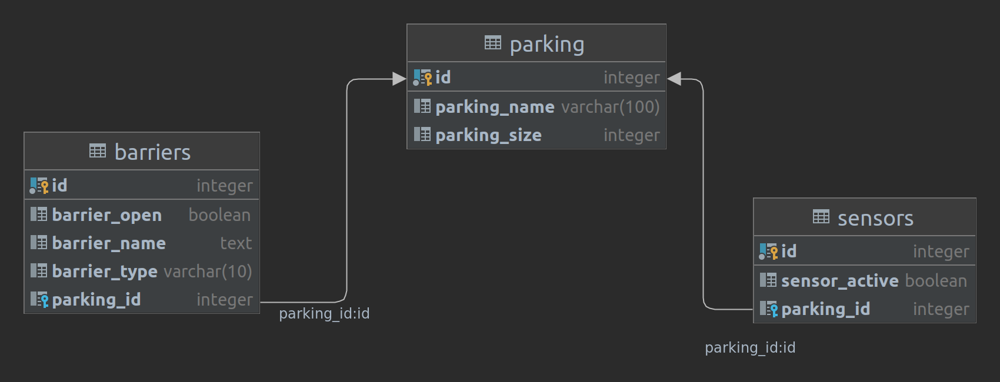

# java-parking-task
## Задача по созданию rest api сервера авто парковки
### Содержание
[Условие задачи](#условие-задачи)  
[Требования](#требования)  
[Решение](#решение)

### Условие задачи
У приложения разработать rest api для работы с внешними устройствами.
* Парковка имеет 2 шлагбаума. Один на въезд, другой на выезд.   
* Шлагбаумы опрашивают приложение на разрешение на въезд.  
* Датчики наличия автомобиля на паркоместе отправляют в приложение свой статус(есть автомобиль/нет автомобиля).  
* Информационное табло парковки опрашивает систему для определения свободных мест парковки.

### Требования
1. Создать сервер с использованием MVC архитектуры.
2. Написать тесты на один из контроллеров.
---
### Решение
  
Тестовые данные уже загружены.  
Для старта тестирования необходимо запустить приложение и проверить эндпойнты.
---
#### База данных:
В задаче используется H2 база, способ запуска - в оперативной памяти.
Ссылка для работы с БД:  
[http://localhost:8080/h2-console](http://localhost:8080/h2-console)  
##### Данные для входа  
* JDBC URL: jdbc:h2:mem:appdb  
* User Name: app  
*Для тестового окружения создается отдельный набор данных по адресу **jdbc:h2:mem:testdb**
---
### Описание api:
Базовый url:
http://localhost:8080
### Получение данных
#### /parking/ GET
Получение списка парковок
#### /barriers/ GET  
Получение списка шлагбаумов парковки
#### /barriers/{id} GET
Получение данных шлагбаума парковки по **id**
#### /sensors/ GET
Получение списка сенсоров наличия автомобиля на паркоместе  
#### /sensors/{id} GET  
Получение данных сенсора по **id**
### Изменение данных
#### /barriers/{id} POST
      {"command":"open"}
Открытие шлагбаума парковки по **id**  
#### /barriers/{id} POST
      {"command":"close"}
Закрытие шлагбаума парковки по **id**

---

#### Схема БД

---
#### Пример кода
    // to do    